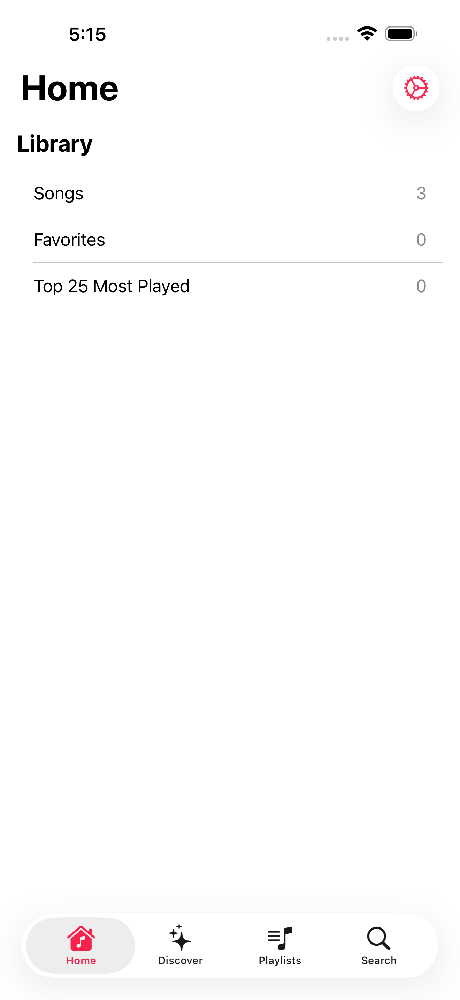
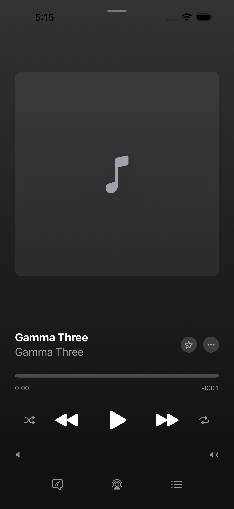
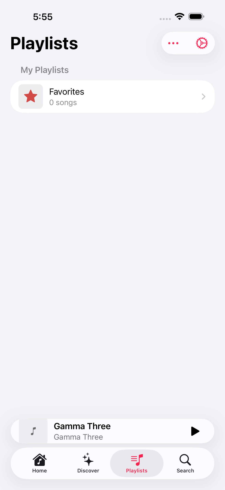

# Petrichor для iPhone (iOS-порт)

Порт маковского [Petrichor](https://github.com/kushalpandya/Petrichor) на iPhone:
тот же проект, два таргета — `Petrichor` (macOS) и `PetrichoriOS` (iOS). Оба
таргета показывают одну и ту же библиотеку (своя копия на каждом устройстве) и
собираются из одного `Petrichor.xcodeproj`.

## Требования

- Xcode 26.6, macOS 26+ для сборки
- iOS 26.1+ на устройстве
- Форк `kushalpandya/Petrichor` (MIT © Kushal Pandya)

## Сборка и тесты

```bash
# iOS (симулятор)
xcodebuild -scheme PetrichoriOS -destination 'platform=iOS Simulator,name=iPhone 17 Pro Max' build
xcodebuild test -scheme PetrichoriOS -destination 'platform=iOS Simulator,name=iPhone 17 Pro Max'

# macOS
xcodebuild -scheme Petrichor -destination 'platform=macOS' build
```

Выход на реальное устройство — через скилл `.claude/skills/petrichor-device/`.

## Как музыка попадает на телефон

Библиотека **переносится с мака целиком** (файл базы с переписыванием путей),
а не сканируется заново — часть метаданных и плейлистов существует только в
базе. Подробности и trade-off: [ADR 0003](docs/adr/0003-library-copied-from-mac.md).
На телефоне библиотека — это `Documents` приложения; на маке пути абсолютные.

## Ограничения

- Сборка на реальном устройстве — подпись бесплатным Apple ID: переустановка
  каждые 7 дней, без iCloud.
- Воспроизведение — только MP3 (AVFoundation): FLAC на iOS не играет.
- Избранное и счётчики прослушиваний, набранные на телефоне, теряются при
  переносе библиотеки (ADR 0003); синк телефон→мак — в работе
  (`PlaybackJournal`, тикет 05: `.scratch/official-port-gaps/issues/05-playback-journal.md`).

## Скриншоты

| Home | Now Playing | Playlists |
|---|---|---|
|  |  |  |

## Происхождение

Форк [kushalpandya/Petrichor](https://github.com/kushalpandya/Petrichor) (MIT).
`main` — одиночный squash-импорт апстрима; обратный мерж не планируется
(см. [ADR 0005](docs/adr/0005-fork-diverges-from-upstream.md)).
